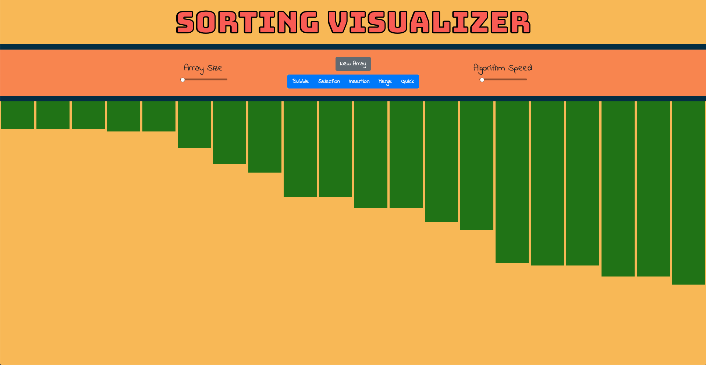

  

<h3 align="center">A web application designed to visualize popular sorting algorithms.</h3>
<h5 align="center">Users can customize the array size, sorting speed, and sorting algorithm. Built with vanilla HTML, CSS, and JavaScript.  </h5
<h1></h1>
<h3 align="center">Live Link:</h3>
<h5 align="center">https://mushiewaffle.github.io/Sorting-Visualizer/  </h5>
<h3 align="center">Supported Sorting Algorithms:</h3>
<h5 align="center">• Bubble Sort • Selection Sort • Insertion Sort • Merge Sort • Quick Sort •</h5>
<h1></h1>
<h3 align="center">Sorting a Large Array</h3>

  

  

<h3 align="center">Sorting a Medium Array</h3>

  

  

<h3 align="center">Sorting a Small Array</h3>

  

  

